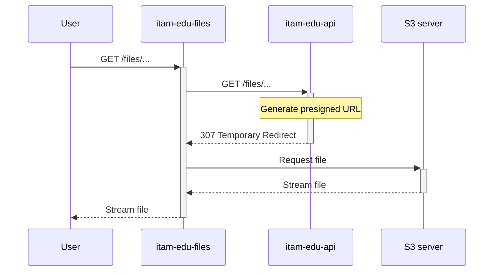

# itam-edu-files

A simple file server backed by S3, designed to offload file streaming from the primary backend
system.

## Architecture

Request handling contains the following steps:

1. Request from the user is received;
2. Request is resent to the api;
3. If authorization passes, the presigned URL is generated and returned;
4. Request is resent to the presigned URL, and response is streamed back to the client.

Proxying is used instead of direct S3 server access to support browser caching, as S3 presigned URLs
have unique query parameters each time they are generated. Moreover, it allows the S3 server to only
be accessible from the internal network.
